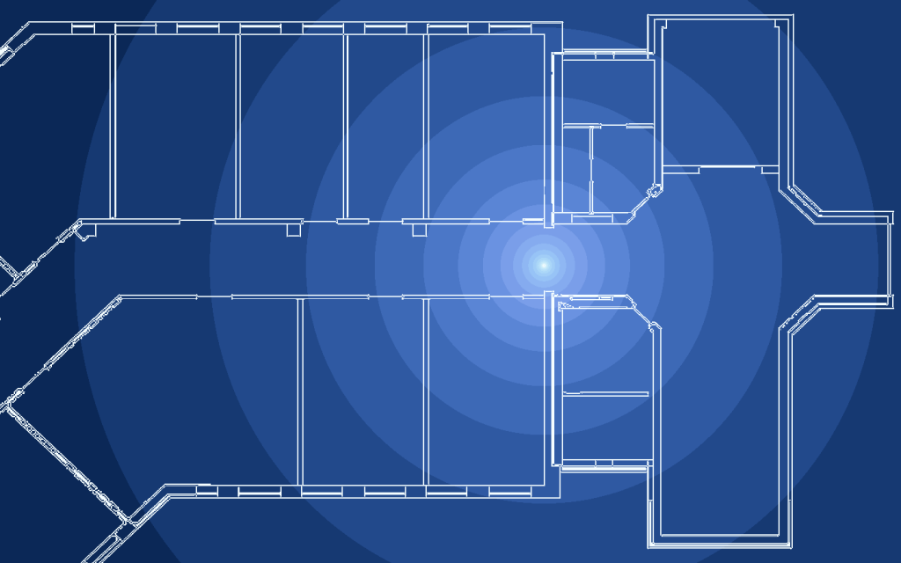
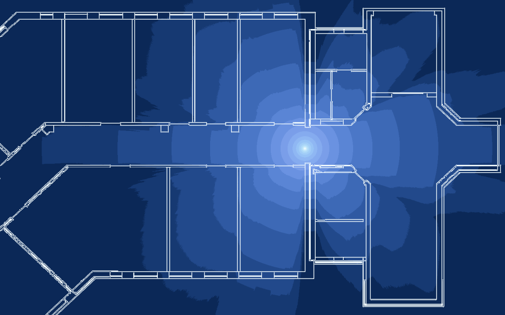
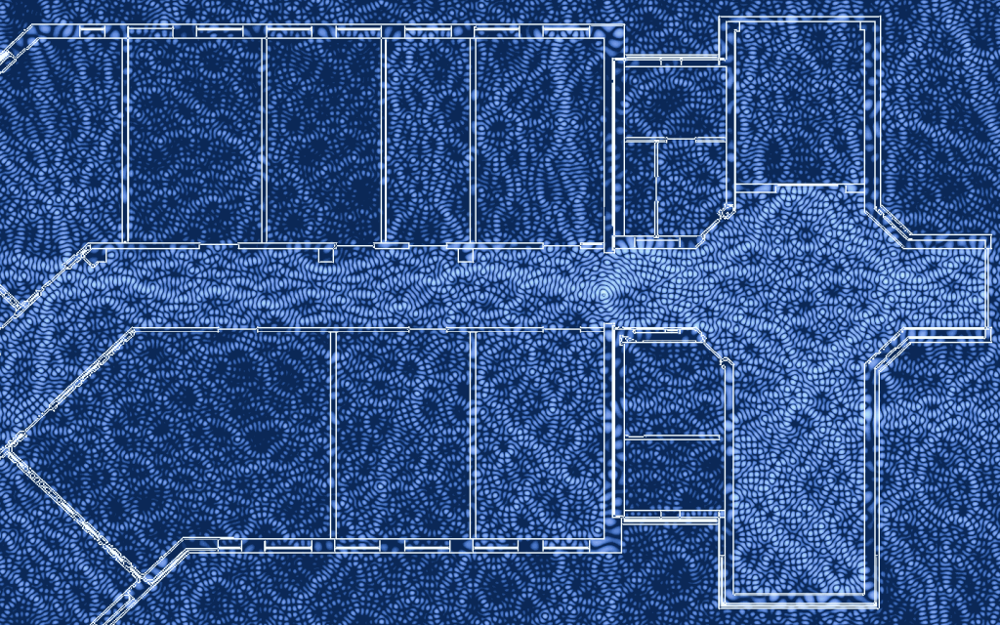

# helmhurts
Using the Helmholtz equation to model the amplitude field of wireless propagation. Additionally, simple path loss and shadowing can be applied to a floorplan PNG image.

This code is inspired by the following [blog entry of Jason Cole](http://jasmcole.com/2014/08/25/helmhurts) that explains the idea and basically solves everything already. 

I initially started by using code from Frédéric Testard ([fredo-dedup](https://gist.github.com/fredo-dedup), [code preview using nbviewer](http://nbviewer.ipython.org/gist/fredo-dedup/31ae1b6017833e9a18f8)).

##Example Outputs
Some example figures produced by the current implementation.
###Path Loss

###Shadowing

###Helmhurts

